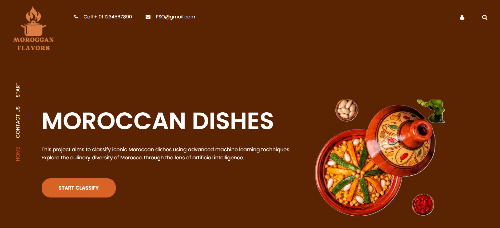
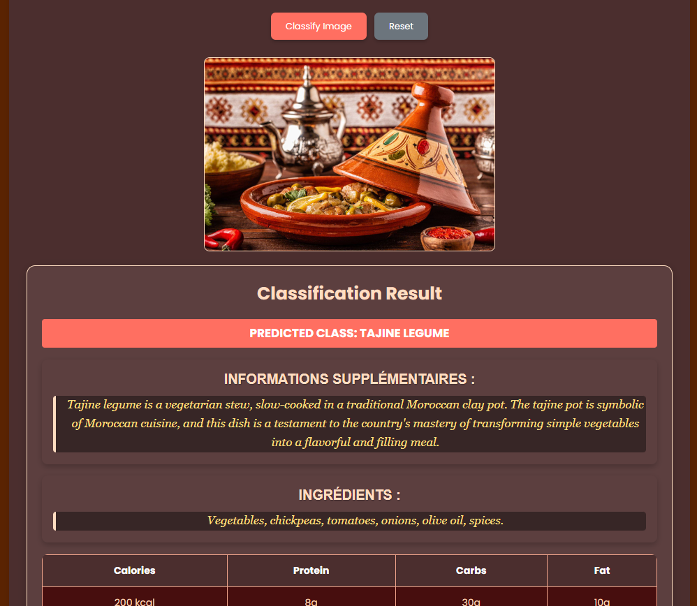
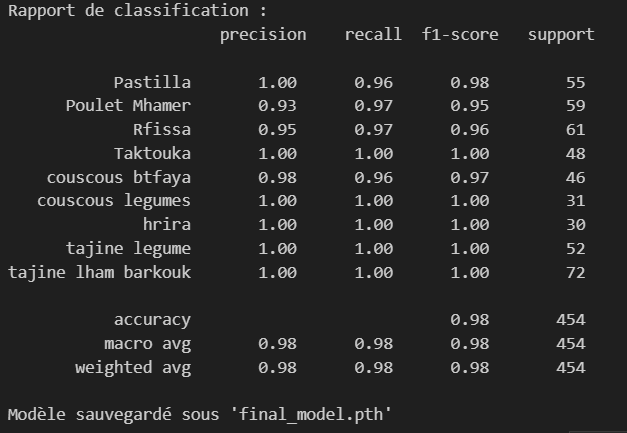
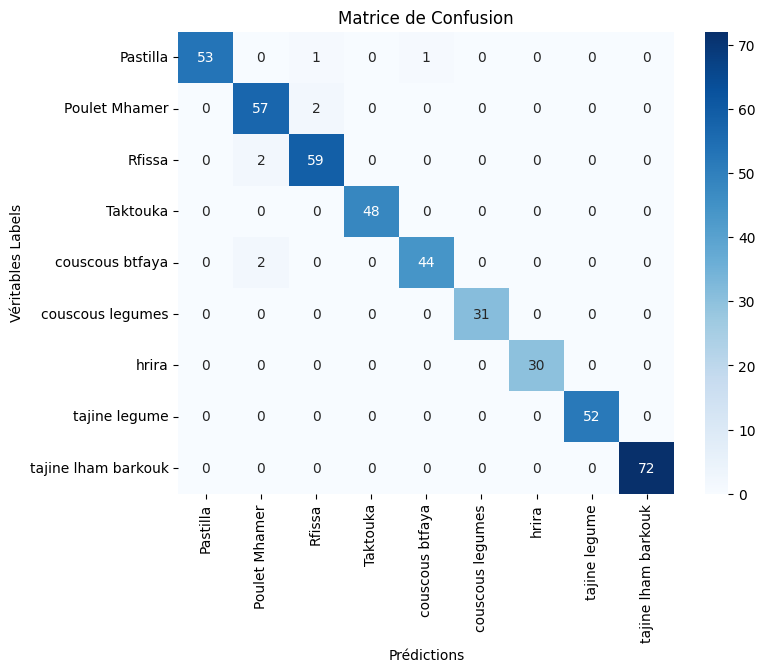

# Classification des Plats Marocains

Ce projet utilise Flask pour créer une application web permettant de classifier des images en utilisant un modèle ResNet18 pré-entraîné. Le modèle a été adapté pour reconnaître 9 classes spécifiques de plats marocains.


## Installation

1. Clonez le dépôt :
   

2. Installez les dépendances :
    ```sh
    pip install -r requirements.txt
    ```

3. Téléchargez le modèle pré-entraîné et placez-le dans le répertoire racine du projet :
    ```sh
    final_model.pth
    ```

## Utilisation

1. Lancez l'application Flask :
    ```sh
    python app.py
    ```

2. Ouvrez votre navigateur et accédez à `http://127.0.0.1:5000`.

3. Téléchargez une image pour obtenir une prédiction de la classe.


## Modèle

Le modèle utilisé est une version modifiée de ResNet18, pré-entraînée sur ImageNet et adaptée pour reconnaître 9 classes spécifiques de plats marocains.

## Classes de Classification

- Pastilla
- Poulet Mhamer
- Rfissa
- Taktouka
- Couscous btfaya
- Couscous legumes
- Hrira
- Tajine legume
- Tajine lham barkouk


## Captures




## Rapport de Classification et Matrice de Confusion

### Rapport de Classification



### Matrice de Confusion



## Auteurs
- [Anas Bidar](https://github.com/anasbr22)
- [Ahmed Ammar](https://github.com/AhmedAmmar2405)
- [Ali Bouziani](https://github.com/bouzianiali)


